<div align="center">

<!-- SEO: Saurabh Chaudhary | Cloud Engineer | DevOps Engineer | Platform Engineer | SRE | AWS | Terraform | Kubernetes | Docker | GitHub Actions | Linux | Prometheus | Grafana | Jenkins | ArgoCD | Cloud Native | Infrastructure as Code | LLMOps | Germany Master's -->

<!-- animated contribution graph: real data, boxes reveal cell by cell
     (regenerated daily by .github/workflows/update-profile-art.yml) -->

<h3><code>saurabh@github ~ $ ./contributions.sh</code></h3>



<br>
<br>

<h3><code>saurabh@github ~ $ whoami</code></h3>

<table>
<tr>
<td valign="top"></td>
<td valign="top"></td>
</tr>
</table>

<br>
<br>

<h3><code>saurabh@github ~ $ ./links.sh</code></h3>

<p><b>Cloud Engineer · DevOps Engineer · Platform Engineer · SRE · Linux Enthusiast</b></p>

[](https://github.com/saurabhcr007)
[](mailto:chaudhary.saurabh200117@gmail.com)
[](https://github.com/saurabhcr007)

<br>

</div>

---

## ⚡ Current Focus

```yaml
# saurabh@github:~$ cat current-focus.yaml

Learning:
  - Advanced Kubernetes: CKA exam prep
  - AWS Solutions Architect: Cloud-native patterns
  - Terraform: Module design & state management
  - ArgoCD: GitOps workflows & application sync
  - Prometheus + Grafana: Custom alerting & dashboards

Building:
  - DevOps automation toolkit (Bash + Python)
  - Kubernetes homelab cluster (k3s on bare metal)
  - Infrastructure-as-Code templates library
  - CI/CD pipeline blueprints with GitHub Actions & Jenkins

Goal:
  - Master's in Computer Science / Cloud Computing — Germany 🇩🇪 (2026)
  - CKA certification
  - Contribute to CNCF open-source projects
```

---

## 🛠️ Tech Stack

### 💻 Core Languages & Scripting

<p>


</p>

### ☁️ Cloud Platforms

<p>


</p>

### ⚙️ DevOps & IaC

<p>


</p>

### 🐳 Containers & Orchestration

<p>


</p>

### 🔄 CI/CD

<p>


</p>

### 📊 Monitoring & Observability

<p>


</p>

### 🔐 Security & Networking

<p>


</p>

### 🗄️ Databases & Messaging

<p>


</p>

### 🔧 Developer Tools

<p>


</p>

---

## 🚀 Featured Projects

> 🔧 Hands-on DevOps & Cloud projects — infrastructure built, not just theorized

| 🔧 Project | 📝 Description | 🛠 Stack |
|---|---|---|
| **DevOps Automation Toolkit** | Bash + Python scripts for system setup, log rotation, health checks, and service monitoring | Bash · Python · Linux · Cron |
| **AWS Infrastructure with Terraform** | Provisioning VPC, EC2, S3, and IAM roles using Terraform — reproducible and version-controlled | Terraform · AWS · GitHub Actions |
| **Dockerized App Pipeline** | End-to-end CI/CD pipeline for a containerized application with automated image build and deploy | Docker · GitHub Actions · Linux |
| **Prometheus + Grafana Monitoring Stack** | Local observability stack with custom dashboards and alerting rules for Linux system metrics | Prometheus · Grafana · Alertmanager |

> 📌 **Update these with your actual repo links** — then pin the top 6 from GitHub profile settings.

---

## 📊 GitHub Analytics

<div align="center">


</div>

<div align="center">


</div>

---

## 🏆 GitHub Trophies

<div align="center">


</div>

---

## 🎓 Certifications & Courses

| Certification / Course | Provider | Status |
|---|---|---|
| AWS Observability | Amazon Web Services | ✅ Completed |
| Getting Started with DevOps on AWS | Amazon Web Services | ✅ Completed |
| Introduction to Linux (LFS101) | Linux Foundation | ✅ Completed |
| AWS Solutions Architect Associate (SAA-C03) | Amazon Web Services | 🔄 In Progress |
| Certified Kubernetes Administrator (CKA) | CNCF | 📅 Planned |

---

## 💡 Engineering Principles

<div align="center">

```
┌─────────────────────────────────────────────────────────────┐
│                                                             │
│   "Infrastructure is code. Code is infrastructure."        │
│                                                             │
│   ▸ Everything declarative. Everything version-controlled.  │
│   ▸ Automate the toil. Monitor the rest.                   │
│   ▸ Security is not a checkbox — it's a culture.           │
│   ▸ Reliability is a feature. Treat it as one.             │
│   ▸ GitOps over ClickOps. Always.                          │
│                                                             │
└─────────────────────────────────────────────────────────────┘
```

</div>

---

<div align="center">

```
  ██████╗██╗      ██████╗ ██╗   ██╗██████╗      ███╗   ██╗ █████╗ ████████╗██╗██╗   ██╗███████╗
 ██╔════╝██║     ██╔═══██╗██║   ██║██╔══██╗     ████╗  ██║██╔══██╗╚══██╔══╝██║██║   ██║██╔════╝
 ██║     ██║     ██║   ██║██║   ██║██║  ██║     ██╔██╗ ██║███████║   ██║   ██║██║   ██║█████╗
 ██║     ██║     ██║   ██║██║   ██║██║  ██║     ██║╚██╗██║██╔══██║   ██║   ██║╚██╗ ██╔╝██╔══╝
 ╚██████╗███████╗╚██████╔╝╚██████╔╝██████╔╝     ██║ ╚████║██║  ██║   ██║   ██║ ╚████╔╝ ███████╗
  ╚═════╝╚══════╝ ╚═════╝  ╚═════╝ ╚═════╝      ╚═╝  ╚═══╝╚═╝  ╚═╝   ╚═╝   ╚═╝  ╚═══╝  ╚══════╝
```

**⭐ If you find my work useful, consider starring my repositories!**

*Building reliable infrastructure, one commit at a time. 🚀*

</div>
